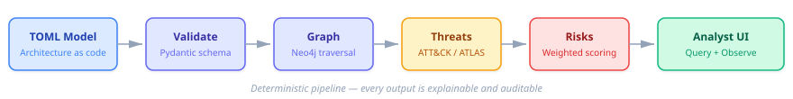

# Threat Forge AI

**Model-driven threat modeling that converts architecture context into explainable, analyst-ready security outputs.**

<p align="center">
  
</p>

---

## The problem

Security teams often have architecture knowledge spread across diagrams, tickets, and tribal memory. Threat models are created once, rarely updated, and disconnected from the actual system structure.

## The approach

Threat Forge AI treats **architecture as code**:

1. **Define** — capture system structure in a canonical TOML model with domains, modules, workflows, trust boundaries, and data classifications.
2. **Validate** — enforce schema integrity and cross-reference checks with Pydantic contracts.
3. **Graph** — load model relationships into Neo4j for attack-path and dependency traversal.
4. **Threat** — generate deterministic ATT&CK and ATLAS-aligned threats using 44 heuristic rules against graph patterns, with optional GraphRAG enrichment (suggested mitigations, related techniques).
5. **Risk** — score and prioritize risks with a transparent weighted formula (six factors, four priority bands).
6. **Interact** — expose evidence-backed answers through a query workflow and Streamlit analyst UI.

Every output is **deterministic** — the same model always produces the same threats, scores, and rankings.

---

## Architecture

<p align="center">
  
</p>

The pipeline flows through seven layers, each with a single responsibility and well-defined I/O contract. The full architecture narrative is in [docs/architecture.md](docs/architecture.md).

### Query workflow

<p align="center">
  
</p>

Analyst questions are routed to tools via deterministic keyword matching, executed against the analysis artifacts, and composed into answers with evidence references and stated limitations. Query quality is regression-tested with versioned golden prompt suites covering both synthetic fixtures and the checked-in fintech example artifacts.

---

## Project structure

<p align="center">
  
</p>

| Directory | Purpose |
|---|---|
| `examples/` | Canonical TOML model examples |
| `models/outputs/` | Generated threat, risk, and trace artifacts |
| `src/models/` | Pydantic schema contracts |
| `src/graph/` | Neo4j client, graph loader, query helpers, Cypher constraints/indexes |
| `src/knowledge/` | MITRE ATT&CK + ATLAS ingestion, local technique catalog, Neo4j GraphRAG chunking/vector search |
| `src/analysis/` | Threat generation engine, layered ATT&CK/ATLAS mapping, risk scoring |
| `src/agents/` | Tool interfaces, deterministic query workflow, observability tracing |
| `src/ui/` | Streamlit analyst interface (model overview, threats, risks, mappings, chat) |
| `src/cli/` | Unified CLI (`threatforge` command) |
| `data/threat_intel/` | Curated mapping rules, expansion config, auto-generated suggestions, knowledge-base SQLite |
| `tests/` | 346 passing tests across 33 modules, plus 2 skipped integration checks |
| `docs/` | Architecture narrative, walkthrough, demo script, diagrams |

---

## Quick start

### 1. Install

```bash
python3 -m venv .venv
source .venv/bin/activate
pip install -e '.[dev]'
```

### 2. Configure Neo4j

```bash
cp .env.example .env
# Set NEO4J_URI, NEO4J_USERNAME, NEO4J_PASSWORD, NEO4J_DATABASE
```

### 3. Sync the knowledge base (optional)

```bash
threatforge sync                   # fetch ATT&CK + ATLAS techniques into the local catalog
threatforge sync --neo4j           # load the MITRE knowledge graph into Neo4j
threatforge sync --embed           # chunk and embed MITRE text into Neo4j TextChunk nodes
threatforge sync --map-heuristics  # refresh Neo4j chunks and generate suggested mappings
threatforge sync --status          # check current sync state
```

### 4. Run the analysis pipeline

```bash
threatforge validate --model examples/fintech_ai_platform.toml
threatforge session --model examples/fintech_ai_platform.toml  # persist the active model for CLI + UI
set -a && source .env && set +a
threatforge load-graph --clear
threatforge generate-threats
threatforge generate-threats --enrich  # add mitigations + related techniques
threatforge score-risks
threatforge session  # inspect the active shared session
```

### 5. Launch the analyst UI

```bash
pip install -e '.[ui]'
threatforge ui
```

---

## Analyst screens

| Screen | Description |
|---|---|
| **Model Overview** | Architecture entities, domain counts, trust boundary summary |
| **Threats** | Generated threats with severity/rule filters, enrichment indicators, suggested mitigations, and related techniques |
| **Risks** | Priority-ranked risks with weighted score drivers and explanations |
| **Mappings** | Curated and suggested technique mappings, heuristic catalog, GraphRAG scoring weight config |
| **Analyst Chat** | Natural-language Q&A grounded in graph, threat, and risk artifacts |

The UI sidebar includes knowledge base sync status, a **GraphRAG enrichment** toggle for rebuilds, and a **Run Rebuild Workflow** action that re-executes the full pipeline (validate → load → threats → risks) in one click. The selected model and the most recent threat/risk artifacts are also persisted in a shared session so CLI and UI stay aligned.

---

## Observability

Every query workflow invocation is traced end-to-end. Traces are written locally to `models/outputs/traces/agent_runs.jsonl` as structured events:

- **`workflow_start`** — analyst question, run ID, timestamp
- **`tool_result`** — tool name, input parameters, response payload, confidence score
- **`workflow_end`** — composed answer, evidence references, limitations

Each event carries a unique `run_id` (format: `run-{12-hex}`) for correlation. The recorder uses a protocol-based composite pattern, so local and remote tracing run simultaneously.

### LangSmith integration (optional)

When enabled, traces are exported to **LangSmith** with parent-child run relationships — the workflow run is the parent, and each tool invocation is a child run with full input/output payloads. This enables cloud-based monitoring, latency analysis, and query-pattern review.

```bash
pip install -e '.[observability]'
export LANGSMITH_TRACING=true
export LANGSMITH_API_KEY=<your_key>
export LANGSMITH_PROJECT=threat-forge-ai
```

No code changes are needed — the factory function `create_trace_recorder()` auto-detects the environment and configures the appropriate recorder stack.

---

## Testing

```bash
pytest -q
```

346 passing tests across schema validation, graph operations, threat generation (44 heuristics), technique mapping, risk scoring, knowledge ingestion, GraphRAG scoring, threat enrichment, chunking, graph vector search, agent workflow, router/query dispatch, observability, session persistence, artifact resolution, application services, and UI layers, with 2 skipped integration checks.

---

## Documentation

| Document | Description |
|---|---|
| [Architecture](docs/architecture.md) | Component breakdown, trade-offs, and extension seams |
| [Architecture Refactor Plan](docs/architecture_refactor_plan.md) | Ordered roadmap for service extraction, query centralization, lazy threat snapshots, and path ownership cleanup |
| [Walkthrough](docs/walkthrough.md) | End-to-end fintech demo case study with example prompts |
| [Demo Script](docs/demo_script.md) | Timed 10–12 minute presentation talk-track |
| [Domain Model](docs/domain_model.md) | Canonical TOML model definition and cross-reference rules |
| [Graph Schema](docs/graph_schema.md) | Neo4j node labels, relationships, constraints, and indexes |
| [Threat Methodology](docs/threat_methodology.md) | Heuristic rule catalog with ATT&CK/ATLAS alignment |
| [Risk Methodology](docs/risk_methodology.md) | Scoring formula, factor weights, and priority bands |
| [ATT&CK/ATLAS Ingestion Design](docs/design_attack_atlas_ingestion.md) | Knowledge-base sync architecture and layered mapping engine |
| [GraphRAG Design](docs/design_graphrag.md) | Neo4j GraphRAG integration: knowledge graph, chunking, vector search, enhanced scoring, threat enrichment |
| [GraphRAG Migration](docs/migration_graphrag.md) | Final-state setup guide for the graph-backed suggestion and enrichment pipeline |
| [Heuristic Expansion](docs/design_heuristics.md) | STRIDE, CAPEC, schema enrichment, and NIST 800-53 heuristic expansion strategy |
| [NLP Quality Fixtures](tests/fixtures/nlp_quality/README.md) | Golden prompt suites and quality metrics for deterministic query workflow regression testing |
| [Diagrams](docs/diagrams/) | Mermaid sources (.mmd) exported to SVG — pipeline, workflow, risk scoring, project layout, knowledge ingestion |

---

## Tech stack

| Layer | Technology | Role |
|---|---|---|
| Language | Python 3.11+ | Type hints, `tomllib`, modern stdlib features |
| Schema validation | Pydantic ≥ 2.8 | Model contracts with cross-reference integrity enforcement |
| Graph database | Neo4j ≥ 5.20 | Property graph for attack-path traversal and dependency analysis |
| Graph protocol | Bolt (official `neo4j` driver) | Parameterised Cypher queries with connection pooling |
| Knowledge base | MITRE ATT&CK + ATLAS | STIX 2.1 / YAML ingestion into a local technique catalog plus a Neo4j knowledge graph with chunked embeddings and native vector search |
| Threat mapping | MITRE ATT&CK + ATLAS | Layered mapping: curated TOML rules, opt-in tactic expansion, context filtering, and GraphRAG suggestion scoring (mitigation gap, sub-technique, tactic overlap) |
| UI | Streamlit ≥ 1.35 | Multipage analyst dashboard (5 screens) with knowledge sync, GraphRAG enrichment, and one-click rebuild |
| Observability | JSONL local traces | Structured event log for every workflow invocation |
| Observability (opt.) | LangSmith | Cloud trace export with parent-child run relationships |
| Testing | pytest ≥ 8.0 | 346 passing tests across 33 modules, plus 2 skipped integration checks — schema, graph, analysis, knowledge, GraphRAG, agents, router/query dispatch, sessions, artifact resolution, application services, UI |

### Why these choices

**Neo4j** — security analysis is inherently a graph problem. "Can a low-trust module reach a regulated datastore through a dependency chain?" is a single Cypher query (`MATCH path = (m)-[:DEPENDS_ON*1..5]->(ds)`) but would require recursive CTEs or application-side joins in a relational database. Neo4j's indexed property graph handles multi-hop traversal, trust-boundary crossings, and attack-path enumeration in sub-second time.

**Pydantic** — the canonical model contract is the foundation every downstream layer depends on. Pydantic's `model_validator` lets us enforce not just type correctness but structural invariants (every module references an existing domain; every workflow references existing modules and objects). Invalid models are rejected before any graph or analysis work begins.

**Deterministic workflow (no LLM)** — the query layer routes analyst questions via regex and keyword matching, not an LLM. This is deliberate: the agent adds value through structured tool orchestration and evidence composition, not generative inference. Outputs are fully reproducible and auditable.

**LangSmith** — optional cloud observability that attaches to the existing trace recorder protocol. When enabled, every workflow invocation (question → routing decisions → tool calls → composed answer) is exported with parent-child run relationships for drill-down analysis. Useful for monitoring query patterns and response quality without changing application code.

**Streamlit** — chosen for rapid UI prototyping with minimal frontend code. The native multipage pattern maps cleanly to the four analyst screens, and the sidebar provides model selection and pipeline rebuild controls in a few lines of Python.

---

## License

Licensed under the Apache License 2.0. See [LICENSE](LICENSE).
