# Threat Forge AI — Architecture

> Model-driven threat modeling: deterministic components produce repeatable, explainable security outputs; agent workflows provide analyst interaction on top.

---

## Pipeline overview

<p align="center">
  
</p>

Architecture data flows through seven layers, each with a single clear responsibility and a well-defined input/output contract. All core analysis is **deterministic** — the same model always produces the same threats and risk scores.

---

## Components

### 1. Canonical model layer

| Attribute | Detail |
|---|---|
| **Source** | `examples/*.toml` |
| **Contract** | `src/models/schema/canonical_model.py` (Pydantic) |
| **Entities** | systems, domains, modules, workflows, objects, datastores, trust boundaries, privilege levels |
| **Responsibility** | Provide the single source of truth for architecture structure and security metadata. Cross-reference integrity is enforced at validation time. |

Architecture definitions are authored in **TOML** — a format chosen for human readability and minimal syntax noise compared to YAML or JSON. Each file describes a complete system: its security domains (trust zones), modules (services and components), data objects with classification levels, workflows that tie modules and data together, and the trust boundaries and dependencies between them.

**Pydantic v2** validates every model at load time. Beyond basic type checking, a custom `model_validator` enforces cross-reference integrity: every module must reference an existing domain, every workflow must reference existing modules and objects, every dependency must connect valid source and target IDs. Duplicate IDs and dangling references are caught before any downstream analysis runs. This contract guarantees that the graph loader, threat engine, and risk engine all receive structurally sound input.

### 2. Graph layer

| Attribute | Detail |
|---|---|
| **Source** | `src/graph/neo4j_client.py`, `src/graph/graph_loader.py`, `src/graph/graph_queries.py` |
| **Storage** | Neo4j with constraints and indexes (`src/graph/cypher/`) |
| **Protocol** | Bolt (via the official `neo4j` Python driver) |
| **Key queries** | neighbours, dependency paths, trust-boundary crossings, exposure checks, attack-path traversal |
| **Responsibility** | Project the canonical model into a property graph that supports path-aware security analysis with sub-second latency. |

**Why Neo4j?** Security analysis is fundamentally a graph problem. Questions like "can a low-trust module reach a regulated datastore through a chain of dependencies?" or "which trust boundaries does this workflow cross?" require multi-hop traversal that a relational database handles poorly. Neo4j's **Cypher** query language makes these patterns concise and performant.

The graph loader creates **9 architecture node types** (`System`, `SecurityDomain`, `PrivilegeLevel`, `Module`, `Object`, `DataStore`, `ExternalActor`, `Workflow`, `TrustBoundary`) and **16 relationship types** (including `DEPENDS_ON`, `IN_DOMAIN`, `HAS_PRIVILEGE`, `STORES`, `INVOLVES_MODULE`, `CROSSES_FROM`/`CROSSES_TO`, and system-level ownership edges). The MITRE knowledge graph adds **5 node types** (`Technique`, `Tactic`, `Mitigation`, `TextChunk`, `HeuristicRule`) and **6 relationship types** (`IN_TACTIC`, `IS_SUBTECHNIQUE_OF`, `MITIGATED_BY`, `CHUNK_OF`, `MAPS_TO`, `IMPLEMENTS_CONTROL`). All writes use `MERGE` on ID keys, making the loader fully **idempotent** — running it twice with the same model produces identical state.

Schema enforcement is applied at the database level: **unique constraints** on every entity ID prevent duplicates, and **indexes** on `internet_exposed`, `ai_relevant`, `classification`, and `regulated` fields accelerate the filtered queries that threat heuristics depend on.

A library of **pre-built named queries** covers the most common security analysis patterns:

| Query | Purpose |
|---|---|
| `internet_exposed_modules` | Find public-facing services |
| `high_value_objects_crossing_boundaries` | Sensitive data crossing trust zones |
| `workflows_involving_sensitive_data` | Workflows handling confidential/secret/regulated objects |
| `high_privilege_externally_reachable_modules` | Privileged services exposed to external actors |
| `modules_depending_on_ai_services` | Non-AI modules with AI dependencies |
| `low_to_high_trust_attack_paths` | Dependency chains from low-trust to high-value (up to 5 hops) |
| `dependency_edges` | All module/datastore dependencies |
| `trust_boundary_crossings` | All trust boundary definitions |

The agent tool layer exposes a stable subset of these queries through query IDs rather than raw Cypher text, keeping the graph layer as the single source of truth for analyst-facing graph retrieval.

### 3. Threat layer

| Attribute | Detail |
|---|---|
| **Source** | `src/analysis/threat_generation.py`, `src/analysis/threat_outputs.py`, `src/analysis/materializer_registry.py`, `src/analysis/heuristics/` (auto-discovered: `th_001`–`th_006` as Python modules, `rules/th_001.toml`–`th_044.toml` for config-driven rules), `src/analysis/heuristics/generic_materializer.py`, `src/analysis/mapping_engine.py`, `src/analysis/mapping_loader.py`, `src/analysis/mapping_types.py` (facade: `src/analysis/technique_mapping.py`), `src/analysis/threat_enricher.py`, `src/analysis/graphrag_scorer.py` |
| **Output** | `models/outputs/threats/*_threats.json` |
| **Mapping** | MITRE ATT&CK (enterprise techniques) and MITRE ATLAS (AI/ML techniques) |
| **Responsibility** | Apply heuristic rules against graph patterns to generate structured, mapped threat candidates with rationale text explaining *why* each threat applies. |

The threat engine runs **44 deterministic heuristics** (TH-001 through TH-044), each defined as a `ThreatHeuristic` dataclass specifying a graph pattern, target type, severity hint, and applicable frameworks. Heuristics are **auto-discovered** from the `src/analysis/heuristics/` package via two mechanisms:

1. **TOML rules** — drop a `th_*.toml` file into `src/analysis/heuristics/rules/`. Each file defines a `[heuristic]` section (rule metadata) and a `[materializer]` section (data-driven threat generation config). The `GenericMaterializer` class interprets the TOML at runtime, supporting iteration, filtering, cross-reference collection, and per-row joins — all without writing Python.
2. **Python modules** — each `th_*.py` module exports a `HEURISTIC` definition and a `ThreatMaterializer` class. Python modules take precedence when both formats define the same `rule_id`.

Both formats are registered automatically at import time. Adding a new heuristic requires only creating a new file — no existing files need modification.

| Phase | Rules | Focus |
|---|---|---|
| Phase 0 (original) | TH-001 – TH-006 | Core structural patterns (exposure, trust, privilege, AI, regulation) |
| Phase 1 (STRIDE) | TH-007 – TH-014 | STRIDE-per-element enumeration (spoofing, tampering, info disclosure, DoS, elevation) |
| Phase 2 (CAPEC) | TH-015 – TH-024 | CAPEC Meta/Standard gap fill (privilege escalation, communication channels, supply chain) |
| Phase 3 (Schema enrichment) | TH-025 – TH-034 | Control absences (missing auth, encryption, validation, rate limiting, logging) |
| Phase 4 (NIST 800-53) | TH-035 – TH-044 | Control-gap detection (NIST control families: AC-4, SC-7, IA-2, SI-10, AU-2, etc.) |

Each heuristic is executed as a Cypher query against the Neo4j graph. Matched patterns are expanded into `ThreatRecord` objects with structured evidence (affected modules, objects, workflows, paths) and human-readable rationale. See [design_heuristics.md](design_heuristics.md) for the full catalog.

**MITRE ATT&CK / ATLAS mapping** is handled by a layered mapping engine split across three modules: `mapping_types.py` (data model), `mapping_loader.py` (TOML I/O and knowledge-base name resolution), and `mapping_engine.py` (curated + tactic-expansion + context-filtering pipeline). The original `technique_mapping.py` remains as a backward-compatible facade re-exporting the public API. Each `rule_id` maps to one or more `TechniqueMapping` entries containing the technique ID (e.g., `T1190`, `AML.T0016`), tactic category (e.g., Initial Access, Defense Evasion), and a rationale explaining the alignment. Coverage validation ensures every heuristic has at least one technique mapping.

**Graph-backed technique suggestion** (Layer 0) complements the curated mapping pipeline with GraphRAG retrieval over MITRE `TextChunk` nodes in Neo4j. The `GraphRAGScorer` (`src/analysis/graphrag_scorer.py`) queries the native vector index, then re-ranks candidates using graph-structural signals: vector similarity (45%), tactic overlap (15%), framework match (10%), mitigation gap (20%), and sub-technique bonus (10%). The mitigation-gap signal compares a technique's known mitigations against the target module's `control_functions`, prioritizing true coverage gaps.

This is an offline advisory layer: suggestions are reviewed by a human and promoted to curated mappings in `mapping_rules.toml`. `threatforge suggest-mappings` always uses the GraphRAG scorer.

**Runtime threat enrichment** (`src/analysis/threat_enricher.py`) is a post-materialization step that traverses the MITRE knowledge graph to add `suggested_mitigations` (controls not implemented by the target module) and `related_techniques` (linked by shared mitigations or sub-technique hierarchy) to each `ThreatRecord`. Enabled via `--enrich` flag or `THREATFORGE_GRAPHRAG=1` env var. Without enrichment, these fields default to empty lists.

**Sync-time mapping generation** extends the sync lifecycle with `--map-heuristics`, which batch-scores all discovered heuristics and writes results to `mapping_suggestions.toml` — a separate file from the human-curated `mapping_rules.toml`. The `MappingWriter` (`src/analysis/mapping_writer.py`) orchestrates the batch flow: refresh Neo4j knowledge chunks, iterate all heuristics, call the GraphRAG scorer per rule with configurable threshold and top-k, and serialize results as TOML. Suggested mappings carry `mapping_type = "suggested"` and do not flow into threat generation unless `include_suggested = true` is set in `mapping_config.toml`.

Example mappings:

- TH-001 → T1190 (Exploit Public-Facing Application), T1078 (Valid Accounts)
- TH-004 → AML.T0016 (Obtain Capabilities — Data Poisoning), AML.T0040 (ML Model Evasion)
- TH-005 → T1530 (Data from Cloud Storage), T1020 (Automated Exfiltration)

### 4. Risk layer

<p align="center">
  
</p>

| Attribute | Detail |
|---|---|
| **Source** | `src/analysis/risk_scoring.py`, `src/analysis/risk_factors.py` |
| **Output** | `models/outputs/risks/*_risks.json` |
| **Formula** | Weighted sum across six factors: likelihood (0.25), impact (0.20), exposure (0.15), privilege sensitivity (0.15), data criticality (0.15), exploitability (0.10) |
| **Responsibility** | Convert each threat into a deterministic risk score with priority band (critical / high / medium / low) and human-readable driver explanations. |

Each threat record is passed through six **scoring functions** that extract normalised factors from the threat's evidence, severity, target type, and technique mappings:

- **Likelihood** — base severity score + bonuses for internet exposure, workflow involvement, and rule-specific patterns.
- **Impact** — base severity + target-type weight (workflows and systems score higher) + affected-object count scaling.
- **Exposure** — base 0.30 + internet-exposure bonus (0.30) + trust-boundary crossings + dependency hop count.
- **Privilege sensitivity** — privilege level scaled proportionally (higher privilege → higher score, capped at 0.60).
- **Data criticality** — object classification level + regulated-data presence + affected-object count.
- **Exploitability** — number of mapped ATT&CK/ATLAS techniques + tactic-specific bonuses (Initial Access +0.20, Lateral Movement +0.15, Privilege Escalation +0.10).

The final score is a weighted sum clamped to `[0.0, 1.0]`. Each `RiskRecord` includes the top three contributing factors as `RiskDriver` objects with their weighted contribution values, plus a plain-language explanation. The report is sorted by score descending, so the most critical risks surface first.

### 5. Agent / query layer

<p align="center">
  
</p>

| Attribute | Detail |
|---|---|
| **Source** | `src/agents/tools.py`, `src/agents/workflow.py`, `src/agents/state.py`, `src/agents/router.py`, `src/agents/executor.py`, `src/agents/composer.py`, `src/agents/tool_protocol.py` |
| **Tools** | `query_graph`, `get_threats`, `get_risks`, `lookup_technique`, `search_knowledge` |
| **Responsibility** | Accept analyst questions, route them to the correct tool(s) via deterministic keyword matching, execute grounded lookups, and compose an `AgentAnswer` with evidence references and stated limitations. |

The query workflow is intentionally **deterministic — no LLM calls** are made during routing or answer composition. This is a deliberate design choice: the agent layer adds value through structured presentation and tool orchestration, not through generative inference.

The workflow is split into three single-responsibility modules: **`QueryRouter`** (`router.py`) handles question → action mapping, **`ActionExecutor`** (`executor.py`) dispatches actions to tools via a `ToolRegistry`, and **`AnswerComposer`** (`composer.py`) aggregates results into the final answer. `QueryWorkflow` (`workflow.py`) is a slim orchestrator that delegates to all three.

Each tool implements a **`Tool` protocol** (defined in `tool_protocol.py`) with a `name` property and a `run(input) -> ToolResponse` method. Tools are registered in a name-keyed `ToolRegistry` built at startup, replacing the earlier if/elif dispatch chain.

**Routing** uses a deterministic pattern matcher:
1. **Regex match** — technique IDs like `T1190` or `AML.T0016` trigger `lookup_technique` immediately.
2. **Keyword match** — terms like "risk", "threat", "graph", "dependency", "explain" route to the corresponding tool. Multiple tools can fire for a single question.
3. **Fallback** — unmatched questions fall through to `search_knowledge`.

Each tool returns a structured `ToolResponse` (Pydantic model) with `ok`, `source`, `evidence` (list of dicts), `confidence` (0.0–1.0), and optional error metadata. The **answer composer** aggregates tool results into an `AgentAnswer` containing the summary text, `evidence_refs` (traceable back to source artifacts), and `limitations` (explicitly stating what the workflow could not answer). All tool invocations are recorded in `AgentState` as `ToolCallRecord` objects for full auditability.

Query quality is protected by golden-suite regression tests under `tests/fixtures/nlp_quality/`. The suite evaluates both synthetic fixtures and the checked-in fintech example artifacts against explicit metrics such as tool coverage, grounded evidence references, required answer phrases, forbidden-tool avoidance, and clean-answer rate.

The five tools cover the full analysis surface:

| Tool | Data Source | Returns |
|---|---|---|
| `query_graph` | Neo4j named queries (`GraphQueries.execute(query_id, params)`) | Graph traversal results |
| `get_threats` | `*_threats.json` artifact | Filtered threat records |
| `get_risks` | `*_risks.json` artifact | Top-N ranked risk records |
| `lookup_technique` | In-memory mapping catalog | ATT&CK/ATLAS technique details |
| `search_knowledge` | Heuristic + mapping corpus | Full-text matches across rules and mappings |

**Knowledge base.** The knowledge layer (`src/knowledge/`) provides a local SQLite catalog for MITRE ATT&CK and ATLAS technique data, synced via `threatforge sync`. The `TechniqueStore` holds tactics, techniques, mitigations, and sync metadata. The `TechniqueIndex` provides an in-memory read-only index for fast lookups by ID, tactic, platform, and framework. Semantic retrieval is handled in Neo4j via `TextChunk` nodes and the native vector index, populated by the chunking pipeline using the `TextEmbedder` protocol (`src/knowledge/embedder.py`) and `SentenceTransformerEmbedder` (optional `.[suggest]` dependency).

### 6. Observability layer

| Attribute | Detail |
|---|---|
| **Source** | `src/agents/observability.py` |
| **Local output** | `models/outputs/traces/agent_runs.jsonl` (structured event log) |
| **Optional** | LangSmith export via `.[observability]` extra |
| **Events** | `workflow_start`, `tool_result`, `workflow_end` |
| **Responsibility** | Record every workflow invocation for audit, debugging, and performance review. The composite recorder pattern supports simultaneous local and remote tracing. |

Observability is built on a **protocol-based recorder pattern** (`TraceRecorder` protocol) with four implementations. Local trace events also carry active analysis-manifest metadata when a manifest is present, so workflow traces can be tied back to the exact threat/risk artifact set that grounded the answer.

- **`NullTraceRecorder`** — no-op, used in tests to avoid side effects.
- **`JsonlTraceRecorder`** — appends structured JSON events to a local file. Each event carries a UTC timestamp, unique `run_id` (format: `run-{12-hex}`), the analyst question, tool responses, and the final composed answer.
- **`LangSmithTraceRecorder`** — exports traces to **LangSmith** for cloud-based monitoring and analytics. Creates parent-child run relationships (workflow run → individual tool runs) and attaches full response payloads. Activated by setting `LANGSMITH_TRACING=true` and providing `LANGSMITH_API_KEY` and `LANGSMITH_PROJECT`.
- **`CompositeTraceRecorder`** — chains multiple recorders so local JSONL and LangSmith tracing run simultaneously.

The factory function `create_trace_recorder()` auto-detects the environment and returns the appropriate composite configuration.

### 7. UI layer

| Attribute | Detail |
|---|---|
| **Source** | `src/ui/app.py`, `src/ui/pages/*` |
| **Framework** | Streamlit (`.[ui]` extra) |
| **Screens** | Model Overview · Threats · Risks · Mappings · Analyst Chat |
| **Responsibility** | Provide analyst workflows for exploring model structure, reviewing generated threats and risks, managing technique mappings, and running natural-language queries against the analysis outputs. Includes knowledge sync, GraphRAG enrichment, and one-click rebuild. |

The UI is built with **Streamlit** for rapid prototyping with minimal frontend code. It uses Streamlit's native multipage pattern — each screen is a standalone module under `src/ui/pages/` that can be rendered independently or routed from the main app shell.

The UI and CLI now share a small persisted **session layer** (`src/session_store.py`) that records the active model, active analysis manifest, and current threat/risk artifact paths. Manifest-backed resolution is preferred before any filesystem discovery fallback, which keeps analyst flows consistent across a Streamlit session and repeated CLI calls.

The sidebar provides four interaction modes:
- **Model selection** — choose from bundled example models or upload a custom TOML file.
- **Knowledge base** — sync status (ATT&CK/ATLAS versions, technique/text-chunk counts), GraphRAG availability indicator, sync options (embed chunks, map heuristics).
- **Rebuild workflow** — sequential pipeline (validate → load → threats → risks) with an optional **GraphRAG enrichment** toggle that adds `--enrich` to the threat generation step.
- **Screen navigation** — five screens: Model Overview, Threats, Risks, Mappings, Chat.

The **Threats** screen displays enrichment indicators, severity/rule/enriched filters, and per-threat detail expanders showing framework mappings, suggested mitigations, related techniques, and evidence. The **Mappings** screen includes curated/suggested mapping browsers, a heuristic catalog, promote-to-curated controls, and a GraphRAG scoring weight editor.

Data access is handled through `src/ui/data_access.py`, which loads Pydantic-validated models and JSON artifacts, builds summary views, extracts enrichment data, and resolves artifacts from the active shared session and analysis manifest before falling back to discovery. All data flows are read-only — the UI never mutates analysis artifacts directly (except for promoting suggested mappings to curated rules).

---

## Architecture trade-offs

| Decision | Rationale |
|---|---|
| **Determinism over generative inference** | Core scoring and threat generation use fixed rules so outputs are repeatable and auditable. |
| **Local-first execution** | All data and analysis run on the developer's machine — no cloud dependency for the MVP. |
| **Agent as interaction layer, not source of truth** | The query workflow adds value through presentation and routing; it does not invent new threats or scores. |
| **Explicit JSON outputs** | `threats.json` and `risks.json` are first-class artifacts that downstream tools or CI pipelines can consume. |
| **Shared persisted session + manifests** | CLI and UI share a small state file for the active model, manifest, and artifact paths, improving correctness without introducing a database-backed application state layer. |
| **Optional observability** | Tracing is always available locally; LangSmith integration is opt-in to keep the core dependency footprint small. |

---

## Extension seams

| Extension | Description |
|---|---|
| **Vector-based technique suggestion** | Use `threatforge suggest-mappings` to find candidate technique bindings for new heuristics via dense-vector similarity + composite scoring. Requires `.[suggest]` extra. |
| **Sync-time mapping generation** | Use `threatforge sync --map-heuristics` to batch-generate suggested technique mappings for all discovered heuristics during sync. Writes `mapping_suggestions.toml` (separate from curated `mapping_rules.toml`). |
| **RAG-backed knowledge search** | Replace the stub `search_knowledge` tool with a retriever-backed connector (e.g., vector store over internal security policies). |
| **Additional ingestion channels** | Ingest SBOMs, IaC definitions, or code metadata alongside TOML models. |
| **Mitigation generation** | Map threats to control frameworks and generate recommended mitigations with coverage scores. |
| **Red-team plan export** | Produce structured red-team engagement plans from high-priority threats. |
| **Multi-project workspace** | Evolve the UI and data layer to manage and compare multiple architecture models. |

---

## Diagram sources

Diagrams are maintained as Mermaid source files (`.mmd`) and exported to SVG via `mmdc`.

| Diagram | Source | Export |
|---|---|---|
| Full pipeline | `docs/diagrams/pipeline.mmd` | `docs/diagrams/pipeline.svg` |
| Query workflow | `docs/diagrams/query_workflow.mmd` | `docs/diagrams/query_workflow.svg` |
| Risk scoring | `docs/diagrams/risk_scoring.mmd` | `docs/diagrams/risk_scoring.svg` |
| Project layout | `docs/diagrams/project_structure.mmd` | `docs/diagrams/project_structure.svg` |
| Hero banner | `docs/diagrams/pipeline_hero.mmd` | `docs/diagrams/pipeline_hero.svg` |

To regenerate all SVGs:

```bash
for f in docs/diagrams/*.mmd; do
  npx -p @mermaid-js/mermaid-cli mmdc -i "$f" -o "${f%.mmd}.svg" -b transparent
done
```
