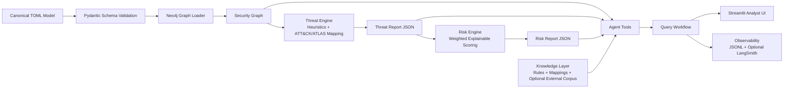

# Threat Forge AI Architecture

## System intent
Threat Forge AI turns a canonical system model into explainable security analysis outputs. The platform is intentionally model-driven: deterministic components produce repeatable outputs, while agent workflows provide analyst interaction on top.

## High-level data flow
The full architecture is captured in `docs/diagrams/architecture.mmd`.

## Components
### 1. Canonical model layer
- Source: `models/examples/*.toml`
- Contract: `models/schema/canonical_model.py`
- Responsibility: stable representation of architecture entities and relationships.

### 2. Graph layer
- Source: `graph/graph_loader.py`, `graph/graph_queries.py`
- Storage: Neo4j with constraints/indexes in `graph/cypher/`
- Responsibility: attack-path and dependency traversal queries.

### 3. Threat layer
- Source: `analysis/threat_generation.py`, `analysis/technique_mapping.py`, `analysis/threat_outputs.py`
- Output: `models/outputs/threats/*_threats.json`
- Responsibility: generate structured, mapped threat candidates with rationale.

### 4. Risk layer
- Source: `analysis/risk_scoring.py`
- Output: `models/outputs/risks/*_risks.json`
- Responsibility: deterministic risk ranking, priority bands, and driver explanations.

### 5. Agent/query layer
- Source: `agents/tools.py`, `agents/workflow.py`
- Responsibility: route analyst questions, execute grounded lookups, and compose evidence-backed answers.

### 6. Observability layer
- Source: `agents/observability.py`
- Output: `models/outputs/traces/agent_runs.jsonl`
- Optional: LangSmith export when env vars are present.

### 7. UI layer
- Source: `ui/app.py`, `ui/pages/*`
- Responsibility: analyst workflows for model summary, threats, risks, and chat.

## Architecture trade-offs
1. Determinism over generative inference in core scoring/generation.
2. Local-first storage and execution to keep the MVP reproducible.
3. Agent orchestration as interaction surface, not source-of-truth logic.
4. Explicit outputs (`threats.json`, `risks.json`) for auditability and downstream reuse.

## Extension seams
- Replace stub knowledge search with retriever-backed RAG connectors.
- Add additional model ingestion channels (SBOM, code metadata).
- Add mitigation generation and control coverage scoring.
- Evolve UI to multi-project and team collaboration workflows.
