# Design: Full MITRE ATT&CK and ATLAS Ingestion

> Architecture and design for ingesting the complete MITRE ATT&CK and ATLAS technique databases into Threat Forge AI, enabling threat model generation against the full corpus while preserving deterministic performance.

---

## 1. Problem statement

The current system maps threat heuristics to ATT&CK/ATLAS techniques via a **hardcoded tuple of 12 entries** in `technique_mapping.py`. This limits coverage to 10 ATT&CK techniques and 2 ATLAS techniques — a tiny fraction of the full corpora:

| Framework | Current | Full corpus (approx.) |
|---|---|---|
| ATT&CK Enterprise | 10 techniques | ~200 techniques + ~400 sub-techniques |
| ATT&CK Mobile | 0 | ~100 techniques |
| ATT&CK ICS | 0 | ~80 techniques |
| ATLAS | 2 techniques | ~50 techniques |

Limitations of the current approach:
- **No sub-technique resolution** — mappings are at technique level only
- **Static bindings** — adding techniques requires code changes
- **No tactic taxonomy** — tactics are free-text strings, not structured objects
- **No mitigation data** — no path from threat to recommended countermeasures
- **No update mechanism** — no way to track ATT&CK version or detect drift

---

## 2. Design goals

| Goal | Constraint |
|---|---|
| **Complete coverage** | Ingest all techniques, tactics, and mitigations from ATT&CK Enterprise/Mobile/ICS and ATLAS |
| **Deterministic performance** | Threat generation must remain fully deterministic — same model → same threats |
| **Sub-second mapping** | Technique lookups and heuristic-to-technique mapping must complete in < 100ms |
| **Offline-capable** | System must operate without internet access after initial data fetch |
| **Version-aware** | Track which ATT&CK/ATLAS version is in use; detect when updates are available |
| **Backward-compatible** | Existing `TechniqueReference`, `ThreatRecord`, and `ThreatReport` schemas unchanged |
| **Minimal dependencies** | Avoid heavy frameworks (no Elasticsearch, no vector DB for core mapping) |
| **Testable** | All components testable without network access or external services |

---

## 3. Data sources

### 3.1 ATT&CK — STIX 2.1 bundles

**Source**: [mitre-attack/attack-stix-data](https://github.com/mitre-attack/attack-stix-data)

Each domain (Enterprise, Mobile, ICS) ships as a single JSON file containing STIX 2.1 objects:

| STIX type | ATT&CK concept | Key fields |
|---|---|---|
| `attack-pattern` | Technique / sub-technique | `external_references[].external_id` (e.g., T1190), `kill_chain_phases[].phase_name` (tactic), `x_mitre_is_subtechnique`, `x_mitre_platforms` |
| `x-mitre-tactic` | Tactic | `x_mitre_shortname`, `external_references[].external_id` (e.g., TA0001) |
| `course-of-action` | Mitigation | `external_references[].external_id` (e.g., M1036) |
| `relationship` | Linkages | `relationship_type` (uses, mitigates, subtechnique-of), `source_ref`, `target_ref` |
| `x-mitre-matrix` | Matrix layout | `tactic_refs` (ordered tactic IDs) |

**Size**: enterprise-attack.json ≈ 18 MB (v18.1), containing ~15,000 STIX objects. All three domains combined ≈ 25 MB.

**Update cadence**: Major releases ~2x/year, minor patches between.

### 3.2 ATLAS — YAML bundle

**Source**: [mitre-atlas/atlas-data](https://github.com/mitre-atlas/atlas-data) (`dist/ATLAS.yaml`)

Single YAML file with structure:

```yaml
id: ATLAS
name: Adversarial Threat Landscape for AI Systems
version: "5.5.0"
matrices:
  - id: ATLAS
    tactics: [...]
    techniques: [...]
    mitigations: [...]
case-studies: [...]
```

**Size**: < 1 MB.

**Update cadence**: ~2–3 releases/year.

---

## 4. Architecture overview

<p align="center">
  
</p>

```
┌──────────────────────────────────────────────────────────────┐
│                     threatforge sync                         │
│              (CLI subcommand — runs on demand)               │
│                                                              │
│   ┌──────────────┐  fetch   ┌──────────────┐  fetch         │
│   │  ATT&CK STIX │◄────────│    GitHub     │────────►│ATLAS│ │
│   │  JSON bundles │         │  (or local)   │         │YAML │ │
│   └──────┬───────┘          └──────────────┘  ┌──────┴─────┐│
│          │                                     │ ATLAS YAML ││
│          ▼                                     └──────┬─────┘│
│   ┌──────────────────────────────────────────────────┐│      │
│   │           Normalizer / ETL                       ││      │
│   │  STIX attack-pattern → Technique                 ││      │
│   │  STIX x-mitre-tactic → Tactic                   │◄──────┘
│   │  STIX course-of-action → Mitigation             │        │
│   │  STIX relationship → technique-tactic links      │        │
│   │  ATLAS objects → same normalized schema           │        │
│   └──────────────┬───────────────────────────────────┘        │
│                  │                                            │
│                  ▼                                            │
│   ┌──────────────────────────────────────────┐               │
│   │      TechniqueStore (SQLite)             │               │
│   │  data/threat_intel/threatforge_kb.db     │               │
│   │                                          │               │
│   │  tables: techniques, tactics,            │               │
│   │    mitigations, technique_tactics,        │               │
│   │    technique_mitigations, meta            │               │
│   └──────────────────────────────────────────┘               │
└──────────────────────────────────────────────────────────────┘

                           │ startup / on-demand
                           ▼

┌──────────────────────────────────────────────────────────────┐
│                  TechniqueIndex                              │
│            (in-memory read-only layer)                       │
│                                                              │
│  - by_id:      dict[str, Technique]                          │
│  - by_tactic:  dict[str, list[Technique]]                    │
│  - by_platform: dict[str, list[Technique]]                   │
│  - by_framework: dict[str, list[Technique]]                  │
│  - tactic_order: dict[str, list[Tactic]]                     │
│  - mitigations_for: dict[str, list[Mitigation]]              │
│                                                              │
│  ≈ 5–8 MB RAM   •   build time < 200ms                      │
└──────────────┬───────────────────────────────────────────────┘
               │
     ┌─────────┴─────────┐
     ▼                   ▼
┌──────────┐    ┌───────────────┐
│ Mapping  │    │  Agent tools  │
│ Engine   │    │  (lookup,     │
│ (rule →  │    │   search)     │
│ technique│    │               │
│ matcher) │    │               │
└──────────┘    └───────────────┘
```

### Key principles

1. **Fetch once, query locally** — raw data is downloaded by an explicit CLI command (`threatforge sync`) and persisted to a local SQLite database. No network calls during threat generation.
2. **Normalize at ingestion** — both STIX and ATLAS are converted to a common internal schema at sync time. Downstream code never touches raw STIX or YAML.
3. **Index in memory** — on first access, the technique store loads into an in-memory `TechniqueIndex` with O(1) lookups by ID and pre-built tactic/platform indexes. Lazy singleton — built once per process.
4. **SQLite for persistence** — zero-configuration, file-based, included in Python stdlib. No additional infrastructure. The DB file is committed to `data/threat_intel/` or generated locally.
5. **Mapping rules remain in code** — heuristic-to-technique mapping rules stay in Python (not in the DB) because they encode domain judgment. The technique *catalog* is externalized; the mapping *logic* is not.

---

## 5. New package: `src/knowledge`

New source package dedicated to threat intelligence data management:

```
src/knowledge/
├── __init__.py
├── models.py           # Normalized data classes (Technique, Tactic, Mitigation)
├── store.py            # SQLite persistence (TechniqueStore)
├── index.py            # In-memory index (TechniqueIndex)
├── sync_attack.py      # ATT&CK STIX → normalized ingest
├── sync_atlas.py       # ATLAS YAML → normalized ingest
└── sync.py             # Orchestrator: fetch + normalize + store
```

### 5.1 Normalized models (`models.py`)

```python
@dataclass(frozen=True)
class Tactic:
    tactic_id: str            # TA0001, AML.TA0001
    name: str                 # "Initial Access"
    framework: str            # ATTACK | ATLAS
    domain: str               # enterprise | mobile | ics | atlas
    shortname: str            # "initial-access"
    order: int                # position in kill chain

@dataclass(frozen=True)
class Technique:
    technique_id: str         # T1190, T1059.001, AML.T0016
    name: str                 # "Exploit Public-Facing Application"
    framework: str            # ATTACK | ATLAS
    domain: str               # enterprise | mobile | ics | atlas
    description: str          # full prose description
    is_subtechnique: bool     # True for T1059.001
    parent_id: str | None     # T1059 for T1059.001, None otherwise
    platforms: tuple[str, ...]  # ("Windows", "Linux", "macOS")
    tactics: tuple[str, ...]  # tactic shortnames: ("initial-access",)
    deprecated: bool
    url: str                  # "https://attack.mitre.org/techniques/T1190"

@dataclass(frozen=True)
class Mitigation:
    mitigation_id: str        # M1036, AML.M0001
    name: str                 # "Account Use Policies"
    framework: str
    domain: str
    description: str
    technique_ids: tuple[str, ...]  # techniques this mitigates
```

### 5.2 SQLite schema (`store.py`)

```sql
CREATE TABLE meta (
    key   TEXT PRIMARY KEY,
    value TEXT NOT NULL
);
-- Stores: attack_version, atlas_version, last_sync_utc, technique_count

CREATE TABLE tactics (
    tactic_id  TEXT PRIMARY KEY,
    name       TEXT NOT NULL,
    framework  TEXT NOT NULL,
    domain     TEXT NOT NULL,
    shortname  TEXT NOT NULL,
    sort_order INTEGER NOT NULL
);

CREATE TABLE techniques (
    technique_id    TEXT PRIMARY KEY,
    name            TEXT NOT NULL,
    framework       TEXT NOT NULL,
    domain          TEXT NOT NULL,
    description     TEXT NOT NULL DEFAULT '',
    is_subtechnique INTEGER NOT NULL DEFAULT 0,
    parent_id       TEXT,
    platforms       TEXT NOT NULL DEFAULT '',   -- JSON array
    deprecated      INTEGER NOT NULL DEFAULT 0,
    url             TEXT NOT NULL DEFAULT ''
);

CREATE TABLE technique_tactics (
    technique_id TEXT NOT NULL REFERENCES techniques(technique_id),
    tactic_id    TEXT NOT NULL REFERENCES tactics(tactic_id),
    PRIMARY KEY (technique_id, tactic_id)
);

CREATE TABLE mitigations (
    mitigation_id TEXT PRIMARY KEY,
    name          TEXT NOT NULL,
    framework     TEXT NOT NULL,
    domain        TEXT NOT NULL,
    description   TEXT NOT NULL DEFAULT ''
);

CREATE TABLE technique_mitigations (
    technique_id  TEXT NOT NULL REFERENCES techniques(technique_id),
    mitigation_id TEXT NOT NULL REFERENCES mitigations(mitigation_id),
    PRIMARY KEY (technique_id, mitigation_id)
);

CREATE INDEX idx_techniques_framework ON techniques(framework);
CREATE INDEX idx_techniques_domain ON techniques(domain);
CREATE INDEX idx_techniques_parent ON techniques(parent_id);
```

### 5.3 In-memory index (`index.py`)

> **Implementation note:** The class-level `_instance` singleton shown below was replaced with a `contextvars.ContextVar` in Phase 4.3 (see [design_review.md Appendix D.3](design_review.md#d3--replace-singleton-techniqueindex-task-43)). The public API (`get()`, `reset()`, `lookup()`, `search()`) is unchanged, but instance storage is now context-scoped rather than process-global.

```python
import contextvars

_current_index: contextvars.ContextVar[TechniqueIndex | None] = contextvars.ContextVar(
    "technique_index", default=None,
)

class TechniqueIndex:
    """Read-only in-memory index built from TechniqueStore. Context-var scoped."""

    _lock = threading.Lock()

    def __init__(self, store: TechniqueStore):
        rows = store.load_all_techniques()
        self.by_id: dict[str, Technique] = {t.technique_id: t for t in rows}
        self.by_tactic: dict[str, list[Technique]] = defaultdict(list)
        self.by_platform: dict[str, list[Technique]] = defaultdict(list)
        self.by_framework: dict[str, list[Technique]] = defaultdict(list)
        # ... build indexes

    @classmethod
    def get(cls, db_path: Path | None = None) -> TechniqueIndex:
        instance = _current_index.get(None)
        if instance is not None:
            return instance
        with cls._lock:
            instance = _current_index.get(None)
            if instance is not None:
                return instance
            store = TechniqueStore(db_path or DEFAULT_DB_PATH)
            instance = cls(store)
            _current_index.set(instance)
        return instance

    @classmethod
    def reset(cls):
        _current_index.set(None)

    def lookup(self, technique_id: str) -> Technique | None: ...
    def techniques_for_tactic(self, tactic_shortname: str) -> list[Technique]: ...
    def techniques_for_platform(self, platform: str) -> list[Technique]: ...
    def search(self, query: str, *, top_k: int = 10) -> list[Technique]: ...
    def mitigations_for(self, technique_id: str) -> list[Mitigation]: ...
```

Module-level convenience functions `get_index()` and `set_index()` provide explicit context management for code that prefers not to use the classmethod API.

**Memory budget**: ~800 techniques × ~500 bytes/technique ≈ 400 KB for the technique dicts, plus tactic/platform cross-indexes. Total < 8 MB including description text. Well within acceptable bounds for a CLI/Streamlit application.

**Build time**: Single pass over SQLite rows into dicts — benchmarks at < 100ms for datasets this size.

### 5.4 Sync pipeline (`sync.py`, `sync_attack.py`, `sync_atlas.py`)

```
threatforge sync [--attack-version latest] [--atlas-version latest] [--offline /path/to/files]
```

Flow:
1. **Fetch** — download STIX bundles from GitHub raw URLs (or read from local files via `--offline`)
2. **Parse** — deserialize JSON/YAML
3. **Filter** — remove revoked and deprecated objects (preserve them with flag for audit)
4. **Normalize** — convert STIX `attack-pattern` → `Technique`, `x-mitre-tactic` → `Tactic`, etc.
5. **Store** — write to SQLite in a single transaction (drop + recreate for atomicity)
6. **Verify** — count checks (expected technique ranges per domain), schema validation
7. **Report** — print summary: version, counts per framework/domain, sync timestamp

**ATT&CK normalization** (`sync_attack.py`):
```python
def _attack_pattern_to_technique(obj: dict, domain: str) -> Technique:
    external_id = next(
        ref["external_id"]
        for ref in obj.get("external_references", [])
        if ref.get("source_name") == "mitre-attack"
    )
    tactics = tuple(
        phase["phase_name"]
        for phase in obj.get("kill_chain_phases", [])
        if phase.get("kill_chain_name", "").startswith("mitre-")
    )
    return Technique(
        technique_id=external_id,
        name=obj["name"],
        framework="ATTACK",
        domain=domain,
        description=obj.get("description", ""),
        is_subtechnique=obj.get("x_mitre_is_subtechnique", False),
        parent_id=None,  # resolved via subtechnique-of relationships
        platforms=tuple(obj.get("x_mitre_platforms", [])),
        tactics=tactics,
        deprecated=obj.get("x_mitre_deprecated", False),
        url=next(
            (ref["url"] for ref in obj.get("external_references", [])
             if ref.get("source_name") == "mitre-attack"),
            "",
        ),
    )
```

**ATLAS normalization** (`sync_atlas.py`):
```python
def _atlas_technique_to_technique(obj: dict) -> Technique:
    return Technique(
        technique_id=obj["id"],            # AML.T0016
        name=obj["name"],
        framework="ATLAS",
        domain="atlas",
        description=obj.get("description", ""),
        is_subtechnique="." in obj["id"] and obj["id"].count(".") > 1,
        parent_id=obj.get("subtechnique-of"),
        platforms=(),
        tactics=tuple(obj.get("tactics", [])),
        deprecated=obj.get("deprecated", False),
        url=f"https://atlas.mitre.org/techniques/{obj['id']}",
    )
```

---

## 6. Mapping strategy evolution

### 6.1 Current: static rule → technique bindings

```
TH-001 ──────► T1190  (hardcoded)
         └───► T1078  (hardcoded)
```

Each heuristic has a fixed set of technique IDs. This approach has two key properties:
- **Deterministic**: always produces the same mappings
- **Manual curation**: expert judgment encoded in code

### 6.2 Proposed: layered mapping with curated rules + tactic-based expansion

The new design preserves curated core mappings while enabling optional expansion from the full technique corpus.

```
                         ┌─────────────────────────┐
                         │     Mapping Engine       │
                         │                          │
   TH-001 ──────────────►│  Layer 1: Curated rules  │──► T1190, T1078
   (rule_id +            │  (explicit technique IDs) │
    frameworks +         │                          │
    tactics +            ├──────────────────────────┤
    context)             │  Layer 2: Tactic match   │──► T1189, T1133, ...
                         │  (auto-expand by tactic  │    (other Initial Access
                         │   from TechniqueIndex)   │     techniques)
                         │                          │
                         ├──────────────────────────┤
                         │  Layer 3: Platform/domain│──► filter by
                         │  filtering               │    model platforms
                         └─────────────────────────┘
```

#### Layer 1 — Curated core mappings (deterministic, always applied)

The existing `RULE_TECHNIQUE_MAPPINGS` tuple is migrated to a **TOML configuration file**:

```toml
# data/threat_intel/mapping_rules.toml

[[mappings]]
rule_id = "TH-001"
technique_id = "T1190"
rationale = "Internet-exposed services are prime targets for public-facing exploitation."

[[mappings]]
rule_id = "TH-001"
technique_id = "T1078"
rationale = "Sensitive internet-facing workflows include credential attack surfaces."
```

These curated mappings are **always included** in threat output. They represent expert judgment and are under version control.

#### Layer 2 — Tactic-based expansion (deterministic, opt-in)

Each `ThreatHeuristic` already declares its applicable `frameworks` and could declare applicable tactics. When tactic expansion is enabled, the mapping engine:

1. Reads the heuristic's target tactics (e.g., `("initial-access", "defense-evasion")` for TH-001)
2. Queries `TechniqueIndex.techniques_for_tactic("initial-access")`
3. Returns all non-deprecated techniques in those tactics
4. Marks these as `mapping_type = "tactic-expansion"` (vs. `"curated"` for Layer 1)

This is **deterministic** — same ATT&CK version + same heuristic definition → same expanded set. Expansion is controlled by configuration:

```toml
# data/threat_intel/mapping_config.toml

[expansion]
enabled = true
include_subtechniques = true
max_techniques_per_tactic = 20    # cap to prevent output bloat
domains = ["enterprise"]          # limit to relevant domains
```

#### Layer 3 — Context-based filtering (deterministic, uses model metadata)

When the canonical model declares platform metadata (e.g., modules running on Linux, cloud services on AWS), the mapping engine filters expanded techniques to relevant platforms:

- Model declares platforms → only techniques matching those platforms are included
- No platform metadata → no filtering applied (all techniques included)

This activates the currently-unused `context` parameter in `map_rule_to_techniques()`.

### 6.3 Mapping output extension

The existing `TechniqueReference` Pydantic model gains one optional field:

```python
class TechniqueReference(BaseModel):
    framework: Literal["ATTACK", "ATLAS"]
    technique_id: str
    technique_name: str
    tactic: str
    mapping_rationale: str
    mapping_type: Literal["curated", "tactic-expansion"] = "curated"  # NEW
```

This lets consumers distinguish curated from auto-expanded mappings. The field defaults to `"curated"` for backward compatibility.

---

## 7. Integration points — what changes

### 7.1 `technique_mapping.py` — refactored

**Before**: hardcoded `RULE_TECHNIQUE_MAPPINGS` tuple, simple list-comprehension lookups.

**After**: thin adapter that delegates to the mapping engine:

```python
def map_rule_to_techniques(
    rule_id: str,
    context: dict | None = None,
) -> tuple[TechniqueMapping, ...]:
    """Map a rule to techniques using the layered mapping engine."""
    index = TechniqueIndex.get()
    curated = _load_curated_mappings(rule_id)       # from TOML
    expanded = _expand_by_tactic(rule_id, index)     # Layer 2
    filtered = _filter_by_context(expanded, context)  # Layer 3
    return curated + filtered
```

The `RULE_TECHNIQUE_MAPPINGS` tuple is removed. `get_all_technique_mappings()` now queries the index.

### 7.2 `threat_outputs.py` — no changes

The `_technique_refs(rule_id)` function continues to call `map_rule_to_techniques()`. The function signature and return type are unchanged. Threat generation is unaffected.

### 7.3 `agents/tools.py` — enhanced

**`lookup_technique()`**: now queries `TechniqueIndex.lookup()` instead of scanning the static tuple. Returns richer data including description, platforms, sub-technique hierarchy, and available mitigations.

**`search_knowledge()`**: technique corpus section now uses `TechniqueIndex.search()` which performs weighted keyword matching over ~800 technique names + descriptions instead of 12 entries. The BM25-style scoring replaces simple term counting.

### 7.4 CLI — new `sync` subcommand

```
threatforge sync                          # fetch latest ATT&CK + ATLAS
threatforge sync --attack-version 18.1    # pin specific version
threatforge sync --offline ./stix-files/  # use local files
threatforge sync --embed                  # also generate technique embeddings
threatforge sync --map-heuristics         # embed + batch-generate suggested mappings
threatforge sync --map-threshold 0.35     # custom composite score threshold
threatforge sync --map-top-k 15           # max suggestions per heuristic
threatforge sync --status                 # show current versions + suggestion count
```

### 7.5 `pyproject.toml` — new dependencies

```toml
dependencies = [
  "pydantic>=2.8,<3.0",
  "neo4j>=5.20,<6.0",
  "httpx>=0.27,<1.0",    # NEW: async HTTP for STIX/ATLAS fetching
  "pyyaml>=6.0,<7.0",    # NEW: ATLAS YAML parsing
]
```

No new optional dependencies — SQLite is in Python stdlib, `httpx` is minimal.

### 7.6 Data directory

```
data/
└── threat_intel/
    ├── threatforge_kb.db       # SQLite knowledge base (generated by sync)
    ├── mapping_rules.toml      # curated heuristic → technique bindings
    └── mapping_config.toml     # expansion and filtering configuration
```

The `data/` directory is added to `pyproject.toml` package data and to the project structure.

---

## 8. Performance analysis

### 8.1 Sync (one-time / on-demand)

| Step | Time estimate | Notes |
|---|---|---|
| Download 3 STIX bundles + ATLAS | 2–5s | ~25 MB total, parallel via httpx |
| Parse JSON/YAML | < 1s | stdlib json + pyyaml |
| Normalize + store to SQLite | < 1s | single transaction, ~1500 rows |
| **Total sync** | **3–7s** | runs only when user invokes `threatforge sync` |

### 8.2 Index build (once per process)

| Step | Time | Memory |
|---|---|---|
| Load SQLite → dataclasses | < 50ms | ~2 MB |
| Build dict indexes | < 50ms | ~4 MB |
| **Total** | **< 100ms** | **< 8 MB** |

### 8.3 Threat generation (per model)

| Operation | Before | After |
|---|---|---|
| `map_rule_to_techniques()` | List scan over 12 entries: < 1ms | Dict lookup + tactic expansion: < 5ms |
| `_technique_refs()` per threat | < 1ms | < 5ms |
| Full threat report (6 heuristics × N targets) | < 50ms | < 100ms |

**Conclusion**: performance impact is negligible. All operations remain well under the existing sub-second latency budget.

### 8.4 Agent tool queries

| Tool | Before | After |
|---|---|---|
| `lookup_technique()` | Scan 12 entries | O(1) dict lookup |
| `search_knowledge()` | Keyword match over ~18 corpus entries | Keyword match over ~850 entries, still < 50ms |

---

## 9. Migration path

### Phase 1 — Knowledge base infrastructure (non-breaking)

1. Create `src/knowledge/` package with models, store, index, and sync modules
2. Add `threatforge sync` CLI subcommand
3. Add `data/threat_intel/` directory with empty DB and default config
4. Add `httpx` and `pyyaml` dependencies
5. Write tests for sync pipeline (with fixture STIX/ATLAS data, no network)

**Deliverable**: `threatforge sync` populates the knowledge base. Existing mapping code is untouched.

### Phase 2 — Mapping engine migration (refactor)

1. Extract curated mappings from `RULE_TECHNIQUE_MAPPINGS` into `mapping_rules.toml`
2. Implement layered mapping engine in `technique_mapping.py`
3. Update `TechniqueReference` with `mapping_type` field (default = `"curated"`)
4. Update `validate_mapping_coverage()` to check against index
5. Update `agents/tools.py` to use `TechniqueIndex`
6. Update tests

**Deliverable**: technique mapping uses the knowledge base. Curated-only mode produces identical output to current system.

### Phase 3 — Tactic expansion (feature)

1. Enable tactic-expansion layer in mapping config
2. Add expansion-control settings to `ThreatHeuristic` dataclass (allowed tactics, max expansion)
3. Add platform-context filtering using canonical model metadata
4. Update UI to distinguish curated vs. expanded mappings
5. Update threat report schema to include mapping statistics

**Deliverable**: threat reports include tactic-expanded technique mappings with clear provenance.

### Phase 4 — Mitigations (feature)

1. Extend threat output with mitigation recommendations sourced from the knowledge base
2. Add `MitigationReference` to `ThreatRecord`
3. Surface mitigations in the Streamlit UI

**Deliverable**: each threat includes recommended MITRE mitigations.

---

## 10. Testing strategy

### Unit tests (no network, no SQLite file)

| Test area | Approach |
|---|---|
| STIX normalization | Fixture JSON with 5–10 representative STIX objects → verify `Technique` output |
| ATLAS normalization | Fixture YAML with 3–5 techniques → verify normalized output |
| TechniqueStore | In-memory SQLite (`:memory:`) → insert, query, verify |
| TechniqueIndex | Build from fixture data → verify all index lookups |
| Mapping engine | Fixture index + curated rules → verify Layer 1/2/3 output |
| Sync pipeline | Mock HTTP responses → verify end-to-end normalization |

### Integration tests (marked, skippable)

| Test area | Approach |
|---|---|
| Live sync | Fetch real ATT&CK data, verify counts within expected ranges |
| Full pipeline | sync → generate-threats → verify mappings reference real technique IDs |

### Regression tests

| Scenario | Verification |
|---|---|
| Curated-only mode | Output identical to current hardcoded system |
| Expansion determinism | Same ATT&CK version + same config → bit-identical output |
| Missing DB | Graceful error message, not crash |

---

## 11. Risk assessment

| Risk | Impact | Mitigation |
|---|---|---|
| STIX schema changes in future ATT&CK versions | Sync breaks | Pin to known-good field paths; version-specific adapters if needed |
| ATLAS YAML format changes | Sync breaks | Pin schema version; validate against published JSON Schema |
| Expanded mappings produce noisy threat reports | Analyst fatigue | Cap via `max_techniques_per_tactic`; default expansion OFF; clear `mapping_type` labeling |
| SQLite file corruption | No technique data | Regenerate with `threatforge sync`; include fallback to curated TOML |
| Large STIX bundles slow CI | Slow tests | Fixture-based unit tests; real data only in integration tests |
| Network unavailability during sync | Can't update | `--offline` flag for air-gapped environments; ship a baseline DB |

---

## 12. Rejected alternatives

### Neo4j for technique storage

Considered storing techniques as additional nodes in the existing Neo4j graph. Rejected because:
- Adds hard dependency on Neo4j for technique lookups (currently optional for graph queries)
- Technique data is reference data, not model-specific — doesn't belong with per-model graph state
- SQLite is zero-config and included in stdlib

### Vector embeddings for technique matching

Considered using sentence embeddings (e.g., sentence-transformers) for semantic technique matching. Rejected because:
- Introduces non-determinism (embedding model versions, floating-point variance)
- Adds heavyweight dependency (~500 MB model)
- Not needed for structured catalog matching — tactic-based expansion is deterministic and sufficient
- Can be revisited as a Layer 4 in the agent's `search_knowledge()` tool without affecting core threat generation

### Python `stix2` library for parsing

Considered using the official `cti-python-stix2` library. Rejected because:
- Adds significant dependency tree
- We only need to extract ~5 fields from attack-pattern objects
- Direct JSON dict access is simpler and faster for our narrow use case
- Reduces supply-chain risk

### Flat JSON files instead of SQLite

Considered storing normalized data as JSON files. Rejected because:
- No indexed queries — every lookup requires loading entire file
- No transactional writes — partial sync could corrupt data
- SQLite provides both with zero additional infrastructure
